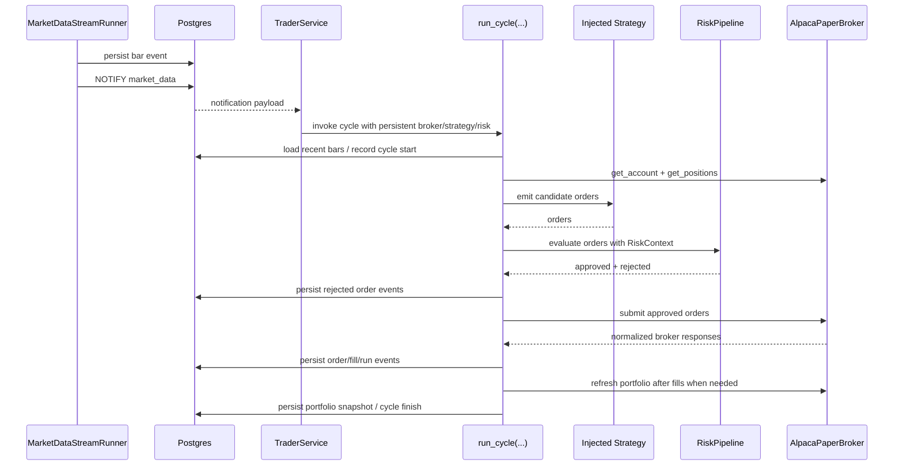

# Runtime Hot Path and Reconciliation (Phase 1)

This document explains the live execution path in implementation terms. It focuses on how data becomes a trading
cycle, where risk is applied, how broker and local state are reconciled, and where the current runtime already
optimizes for correctness and latency.

## Hot Path Overview

The live path is triggered by new market data, not by a fixed schedule alone.

At a high level:

1. market-data ingestion persists a new bar
2. Postgres emits a notification
3. `TraderService` receives the notification and coalesces execution
4. `run_cycle(...)` loads the decision context
5. the injected strategy emits candidate orders
6. the injected risk pipeline filters them
7. the broker submits surviving orders
8. broker responses, fills, and portfolio refreshes are persisted

This is the system’s hot path because it is the latency-sensitive loop that determines whether a fresh market event
becomes a trade decision.

## Startup Path

Startup is part of the hot-path architecture because it defines the initial truth from which all later cycles run.

### 1. Configuration and injection

The wrapper script loads YAML and environment values, constructs the strategy object, constructs the risk pipeline,
and injects both into `TraderService`. This is a deliberate architectural boundary: the runtime never owns user-code
loading as a first-class concern.

### 2. Long-lived runtime object creation

`TraderService` constructs:

- the event store
- a persistent broker instance
- runtime control settings such as cadence and notification channel

Strategy and risk instances are reused across cycles rather than rebuilt on every invocation.

### 3. Run-session start

The service records a run session before entering the live loop. This establishes the audit boundary for the live
runtime instance.

### 4. Startup recovery

Startup recovery runs before the service begins processing market-data notifications.

Supported modes:

- `resume`
- `fail_closed`

Behavior:

- inspect local open `order_events`
- inspect broker open orders
- append local transitions for stale or changed orders
- adopt in-scope broker-open orders that are missing locally
- fail closed if out-of-scope broker orders are present

This is **local-state reconciliation against broker truth**. It is not an execution mode and it must not be confused
with order submission.

### 5. Alpaca portfolio reset and validation

When live trading is configured with broker-backed portfolio state:

- account cash and positions are fetched from Alpaca
- local `position_snapshots` are overwritten from the broker account
- the broker portfolio is validated against configured symbols and asset class

If the broker account is outside the configured universe, startup aborts. This is a deliberate fail-closed rule.

### 6. Metrics worker startup

The metrics worker starts after recovery and portfolio reset. This ordering matters: metrics should observe the same
broker-backed truth that the live runtime will trade against.

## Steady-State Realtime Path

### 1. Notification receipt

The streamer persists bars and emits Postgres `NOTIFY` payloads containing:

- symbol
- timeframe
- timestamp
- asset class
- source

`TraderService` listens on the configured channel and receives these notifications as the primary realtime trigger.

### 2. Trigger coalescing and duplicate suppression

The service tracks the most recent notification key and timestamp so duplicate notifications do not cause redundant
cycle execution. This is an existing optimization and also a correctness guard.

### 3. Cycle invocation

`TraderService` calls `run_cycle(...)` with:

- the persistent broker instance
- the injected strategy
- the injected risk manager
- the event store
- the loaded config

This preserves object reuse and avoids rebuilding core runtime dependencies in the hot path.

### 4. Broker-backed portfolio load

For Alpaca live trading, the cycle loads current broker account state rather than trusting cached local intent. This
load also validates broker positions against the configured universe after symbol and asset-class normalization.

### 5. Market-data readiness and staleness checks

The cycle attempts to ingest or fetch bars, then falls back to recent stored bars when appropriate. The cycle skips
trading if no usable fresh data exists.

### 6. Strategy emission

The injected strategy receives the market context and emits candidate orders. The strategy is responsible only for
expressing trade intent, not for authorizing or reconciling that intent.

### 7. Risk filtering

Candidate orders are enriched with runtime metadata and passed through `RiskPipeline`.

The pipeline receives `RiskContext`, which includes:

- current positions
- open local orders
- price lookup
- run and cycle identifiers
- decision timestamp
- halt state

Risk managers run sequentially. Approved orders flow forward; rejected orders are persisted and logged with explicit
rejection reasons.

### 8. Broker submission

Orders that survive risk checks are submitted through the broker adapter.

For Alpaca:

- client order IDs are deterministic
- existing local order history is consulted for idempotency
- targeted reconciliation is preferred over repeated broad scans in the submit hot path

### 9. Broker response and fill handling

Broker responses are normalized into canonical status values and recorded. When fills occur:

- `fill_events` are appended
- Alpaca-backed portfolios are refreshed from the broker rather than locally inferred from order intent

### 10. Cycle summary

The cycle emits a summary covering:

- orders emitted
- orders rejected locally
- orders validated
- orders submitted
- broker responses

This makes the hot path externally reviewable from logs alone.

## Sequence Diagram

## Risk Management in the Hot Path

Risk is not a post-processing concern. It is part of the core execution path between strategy intent and broker
submission.

### Placement

Risk runs after order enrichment and before broker submission.

### Input model

`RiskContext` is the runtime contract for risk evaluation. It gives risk managers the minimum state they need to
make consistent decisions:

- positions
- open orders
- prices
- run/cycle identity
- decision timestamp
- halt state

### Open-order guard behavior

The open-buy guard prevents the engine from stacking multiple open buy orders for the same symbol when earlier ones
have not yet reached terminal state. This is especially important in the live loop where market-data notifications may
arrive faster than broker fills settle.

### Persistence and logs

Risk rejections are:

- persisted into `order_events`
- logged explicitly at runtime

This keeps risk behavior explainable both from logs and from the event store.

## Broker and Internal-State Reconciliation

### Startup recovery modes

`TraderService` supports two startup recovery modes:

- `resume`
- `fail_closed`

`resume` is the normal live mode. `fail_closed` is for cases where any unresolved broker-open state should prevent
the service from starting.

### Local-open closure

If local history says an order is still open but broker reality does not confirm that order, the runtime appends a
terminal local event with `rejection_reason="reconciled_missing"`. This removes stale blockers without rewriting
history.

### Broker-open adoption

If broker-open orders exist in the configured universe but are missing locally, the runtime adopts them into local
order history. This ensures risk and audit state reflect the real broker state the service is inheriting.

### Clean-start semantics

`run_order_recovery.py clean-start` is not a broker action. It closes **local open orders only** in the configured
universe. Its purpose is to reset local order-state assumptions, not to cancel broker orders.

### Portfolio reset and mismatch handling

Portfolio reset is separate from order recovery:

- startup sync overwrites local portfolio snapshots from Alpaca
- then validates those positions against configured symbols and asset class
- mismatch causes immediate failure

This ordering ensures local state is made truthful even when the service later refuses to trade.

## Maintenance Procedures and Rationale

### `report`

Use `report` when the operator needs a read-only view of:

- local open order state
- broker open order state
- universe mismatch conditions

Rationale:
inspection should be possible without any state mutation.

### `reconcile`

Use `reconcile` when local order history and broker reality have diverged.

Rationale:
the engine needs local state repaired so runtime guards, idempotency logic, and operator diagnostics reflect the
current broker world.

### `clean-start`

Use `clean-start` when local open-order assumptions should be cleared before a new service run, but broker state
should remain untouched.

Rationale:
state cleanup and trade execution are intentionally separated so maintenance does not silently become a broker-side
control plane.

## Performance Characteristics

### Existing optimizations

- `TraderService` owns a persistent broker instance instead of rebuilding the broker each cycle.
- Strategy and risk instances are injected once and reused across cycles.
- Postgres `LISTEN/NOTIFY` is used for cycle triggering instead of polling for new bars.
- Duplicate notification suppression reduces redundant cycle execution.
- Single-flight behavior prevents overlapping work in the realtime loop.
- Submit-time reconciliation avoids repeated broad `GET /v2/orders` scans when a targeted broker lookup is sufficient.

### Pending optimizations

- Reduce repeated `get_account` / `get_positions` calls across metrics sampling and cycle execution.
- Make broker refresh boundaries more explicit so metrics and trading do not duplicate the same remote reads unnecessarily.
- Profile strategy and risk execution for reusable bar-window or price-lookup work.
- Review remaining hot-path queries against the event store for opportunities to reduce repeated reads.

These are optimization candidates, not current correctness gaps.

## Failure Modes

### Stale or missing market data

The cycle skips trading. This prevents the runtime from acting on incomplete or obsolete information.

### Broker universe mismatch

The runtime fails closed. A live engine must not trade against an account whose state does not match the configured
instrument universe.

### Uncertain broker outcome (`error`)

The runtime preserves explicit error state and requires reconciliation before treating the order as resolved. This
prevents the engine from guessing whether a broker action actually completed.

### Stale local order state

Startup recovery or operator reconciliation repairs local history. The engine must not leave old local-open orders in
place indefinitely when broker reality no longer supports them.

### Operator misuse of maintenance commands

Maintenance commands are intentionally separated from normal trading execution. `clean-start` is local-only so that
maintenance does not silently become broker execution.
