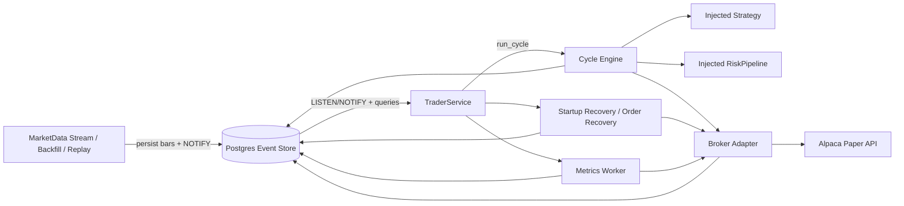

# Trader Core Architecture

This document describes the core trading engine as a reviewable software system rather than as a user guide.
It focuses on component boundaries, runtime contracts, state ownership, and the reasoning behind the current
architecture.

## Purpose and Product Boundary

`trader` is a **core trading engine**. It is intentionally narrower than the complete Trader platform.

The system must be understandable and operable without:

- a dedicated client application
- a frontend control surface
- a deployment productization layer

The active system is therefore defined around:

- market-data ingestion
- event persistence
- strategy execution
- risk filtering
- broker execution
- backtesting
- live paper execution through Alpaca
- runtime observability and operator recovery

The runtime is **Postgres-first**.

## System Principles

### Safety First

The system defaults to not trading when runtime truth is ambiguous. This is visible in several design choices:

- stale or missing market data causes cycle skip
- broker/account mismatches cause fail-closed startup or cycle abort
- uncertain broker outcomes remain explicit `error` states
- startup recovery repairs local state before the service begins normal execution

### Explicit State Transitions

The engine does not treat trading as an opaque side effect. Order, fill, run, cycle, and position state are
persisted as explicit, append-only event records. This supports reconstruction, audit, and post-hoc diagnosis.

### Injection-First Composition

Strategies and risk managers are constructed in user code and injected into the runtime. The engine does not own
user-code loading as a primary concern. This keeps the platform behaving like a normal Python library rather than
like a plugin host.

### Core / Standard Boundary

The codebase now enforces a strict package boundary:

- `trader` contains immutable contracts, orchestration, state models, and runtime primitives
- `trader_standard` contains the project-maintained concrete indicators, signals, strategies, and risk managers

Dependency direction is one-way. `trader_standard` depends on `trader`; core runtime code does not import
`trader_standard`.

### Broker-Truth for Live Portfolio State

For Alpaca-backed live trading, the broker account is the source of truth for:

- current positions
- cash balance
- open orders

Local state is preserved as an audit trail and for runtime reasoning, but it is reconciled against the broker rather
than treated as authoritative for live account state.

### Append-Only Auditability

The runtime repairs history by appending new events, not by mutating earlier records in place. Reconciliation,
recovery, and cleanup therefore preserve operator visibility into what the system previously believed and how that
belief changed.

## Logical Components

### 1. Market-Data Ingestion and Replay

This subsystem is responsible for producing bar events and triggers for runtime execution.

Primary responsibilities:

- subscribe to Alpaca websocket feeds
- backfill historical bars
- persist normalized bar events
- emit Postgres notifications for newly persisted bars
- replay stored bars back into the realtime path for deterministic testing or operational workflows

Representative runtime objects:

- `MarketDataStreamRunner`
- `MarketDataIngestor`
- `AlpacaMarketDataSource`
- replay and backfill runners

### 2. Event Store and Schema Layer

The event store provides the runtime’s persistence, transaction boundary, and queryable audit trail.

Primary responsibilities:

- bootstrap schema
- persist append-only market, prediction, signal, order, fill, run, session, metrics, and portfolio events
- preserve bounded prediction-to-signal/order lineage
- expose transactional writes and query access
- support filtered writes based on runtime logging configuration

Representative runtime objects:

- `EventStore`
- `FilteredEventStore`

### 3. Strategy Layer

The strategy layer consumes market-data context and emits candidate orders. It is intentionally narrow: it should
not own broker-side recovery, portfolio reconciliation, or runtime orchestration.

Primary responsibilities:

- transform market information into trading intent
- encapsulate strategy-specific signal usage
- preserve any necessary strategy-local state across cycles via long-lived injected objects

Representative runtime objects:

- `Strategy`

Representative standard implementations outside core:

- `trader_standard.ToggleUnitStrategy`
- `trader_standard.LongFlatSignalStrategy`
- `trader_standard.build_trend_following_strategy(...)`
- `trader_standard.build_mean_reversion_strategy(...)`
- `trader_standard.build_bollinger_band_strategy(...)`
- `trader_standard.PredictionDrivenStrategy`

Strategies declare a `decision_scope`. `per_symbol` strategies run independently for each symbol callback.
`universe_snapshot` strategies run once only after the complete configured universe is synchronized at one decision
timestamp. This distinction is used by cross-sectional and portfolio predictors and is enforced in both backtest and
stream cycle paths.

Core model inference lives in `trader.predictions` as provider-neutral contracts. A `FeatureProvider` produces a
point-in-time, content-hashed `FeatureBatch`; a `Predictor` produces typed raw `PredictionObservation` records under an
immutable `ModelIdentity`; and a strategy-owned `PredictionMapper` converts those outputs into strategy inputs. The
model cannot emit orders directly. Optional MLflow loading and maintained feature/mapper/strategy implementations live
outside core in `trader_mlflow` and `trader_standard` respectively.

### 4. Risk Layer

The risk layer filters candidate orders before broker submission. It exists as a separate composition layer so that
order-generation logic and order-authorization logic remain distinct.

Primary responsibilities:

- inspect candidate orders against runtime context
- reject unsafe or inconsistent orders
- provide explicit rejection reasons
- support composition through ordered pipelines

Representative runtime objects:

- `RiskManager`
- `RiskPipeline`
- `RiskContext`

Representative standard implementations outside core:

- `trader_standard.OpenBuyOrderLimitRiskManager`

Protective exits such as fixed stop-loss and trailing-stop behavior are intentionally implemented in strategy-space
for the standard policy-driven strategies, so the risk layer remains an order-validation layer rather than an
order-generation layer.

### 5. Broker Layer

The broker layer translates engine order intents into venue-specific submission and state lookup behavior.

Primary responsibilities:

- submit orders
- normalize venue-specific status and symbol formats
- normalize fill payloads into audit/accounting fields
- expose positions, account, and order state
- reconcile local audit state against broker reality

Representative runtime objects:

- `Broker`
- `AlpacaPaperBroker`
- `InternalPaperBroker`
- `NoOpBroker`

Broker adapters also follow the functional-core/imperative-shell boundary used by the runtime. `broker.core` and
`broker.internal` own provider calls, clocks, UUIDs, sleeps, logging, and persistence handoff. Deterministic broker
payload shaping lives in `broker.alpaca_domain` and `broker.internal_execution`: request-field normalization,
reconciliation plans, lookup queries, fee math, slippage math, and canonical broker response payloads are pure value
transforms before the adapter shells apply side effects.

### 6. Runtime Orchestration

`TraderService` owns long-lived runtime behavior. It is responsible for starting a trading run, performing startup
recovery, selecting loop vs realtime execution, and ensuring the cycle engine is invoked with stable runtime objects.

Primary responsibilities:

- own injected strategy and risk manager instances
- own a persistent broker instance
- run startup recovery before trading
- reset local Alpaca portfolio snapshots from broker state
- listen for market-data notifications in realtime mode
- avoid overlapping execution through a coalesced single-flight loop

Representative runtime object:

- `TraderService`

The runtime package follows a functional-core/imperative-shell split. `TraderService` remains the orchestration shell:
it owns network listeners, event-store reads and writes, broker calls, logging, metrics worker lifetimes, and cycle
execution. Pure or mostly pure decisions are kept in focused runtime modules:

- `runtime.service_config` normalizes service configuration, Postgres notification payloads, execution-mode choices,
  reconciliation timing, metrics worker settings, and startup seed inputs.
- `runtime.broker_factory` constructs the configured runtime broker so CLI tools and the service use the same broker
  selection path without importing private service helpers.
- `runtime.portfolio_sync` normalizes broker account and position payloads into startup snapshot and fail-closed
  portfolio-mismatch decisions.
- `runtime.order_recovery` shapes local and broker order-recovery values before the `runtime.orders` shell persists
  repair events.
- `runtime.status_payloads` and `runtime.health` convert status query rows into operator-facing payloads and health
  assessments while `runtime.status` owns event-store queries and halt-state writes.

The cycle package follows the same split. `cycle.pipeline`, `cycle.recording`, and `cycle.stream_pipeline` own
event-store access, broker calls, queues, logging, and state mutation. `cycle.orders`, `cycle.broker_state`, and
`cycle.stream` hold the focused decision helpers for recording broker responses, interpreting broker-response side
effects, and planning per-event realtime stream processing.

### 7. Portfolio, Metrics, and Sessions

This subsystem turns event history and broker state into operational state and review artifacts.

Primary responsibilities:

- represent current portfolio state
- persist portfolio snapshots
- record metrics samples and trading-session metadata
- provide the audit trail for later analysis

Representative runtime objects:

- `Portfolio`
- `MetricsWorker`
- run/session event recording in the event store

### 8. Operator Recovery Tooling

Recovery tooling is intentionally separate from the trading entrypoint. Its purpose is to repair or inspect local
runtime state, not to act as another execution modality.

Primary responsibilities:

- inspect local and broker open-order state
- reconcile local order history from broker reality
- perform local-only cleanup of open order state before a fresh run

Representative runtime surface:

- `run_order_recovery.py`
- startup recovery helpers in `order_recovery.py`

## Key Classes and Responsibilities

| Class / Function | Responsibility |
| --- | --- |
| `TraderService` | Owns long-lived runtime execution, startup recovery, broker reuse, and loop/realtime orchestration |
| `run_cycle(...)` | Executes one decision cycle from data availability through persistence and broker interaction |
| `Strategy` | Produces candidate orders from market context |
| `RiskManager` / `RiskPipeline` / `RiskContext` | Filters candidate orders using portfolio, order, price, and runtime metadata |
| `Broker` / `AlpacaPaperBroker` / `InternalPaperBroker` | Executes or simulates order submission and exposes broker state |
| `MarketDataIngestor` / `MarketDataStreamRunner` | Persist bar events and emit runtime triggers |
| `Portfolio` | Represents current positions and cash and persists snapshots |
| `EventStore` | Persists and queries the append-only runtime record |

## Component Diagram

## State Model and Source of Truth

### Event-Store Truth

The event store is the source of truth for the engine’s **audit history**:

- market bars
- run and cycle lifecycle
- signal emissions
- order lifecycle events
- fill records
- position snapshots
- metrics snapshots
- session tagging

This is the record used to explain what the engine believed and did.

### Broker Truth

For live Alpaca trading, the broker is the source of truth for **current account state**:

- current open positions
- cash balance
- live open-order state

This distinction is deliberate. The engine does not assume that its own prior intent history is sufficient to infer
the current broker account state safely.

### Reconciled Truth

The runtime’s stable operational model is therefore:

- local state is authoritative for history
- broker state is authoritative for live account status
- reconciliation joins those two worlds without overwriting the audit trail

## Architectural Rationale

### Why runtime objects are injected rather than config-loaded

The engine’s extension points are strategies and risk managers. Those are user code, not platform-owned configuration.
Direct injection keeps the system simple, Python-native, and externally extensible without central registration.

### Why live portfolio state is broker-sourced

Local intent is not enough to represent live truth. Orders can remain open, fill partially, or be affected by broker
state the engine did not create during the current process lifetime. Pulling portfolio truth from Alpaca is therefore
safer than deriving it solely from local order intent.

### Why recovery is local-state reconciliation, not broker execution

Recovery exists to repair or align the engine’s internal view of the world. It is intentionally separated from trade
execution so operators can reason about state repair without implicitly sending broker-side actions.

### Why UI and client concerns are out of phase

The current phase proves engine correctness, safety, and auditability. Human-facing control surfaces are later-phase
consumers of the engine, not part of its core architectural boundary.
